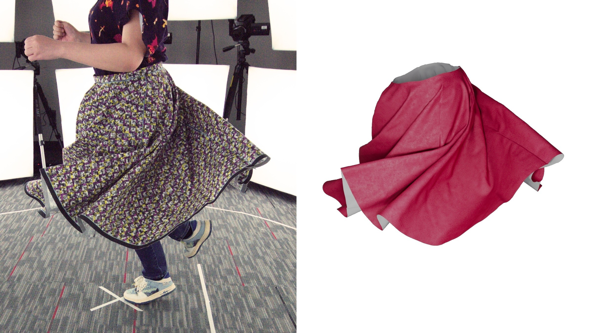
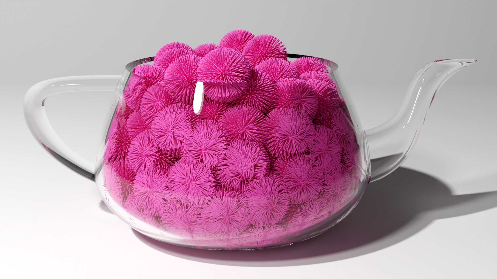
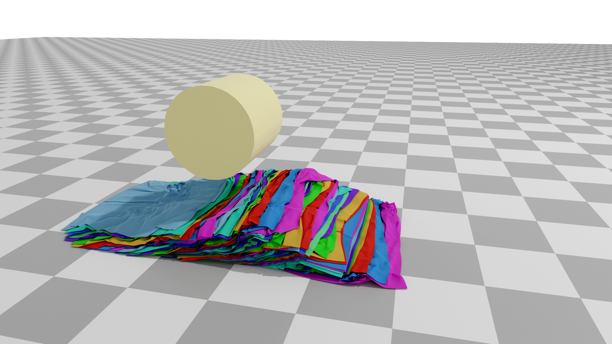
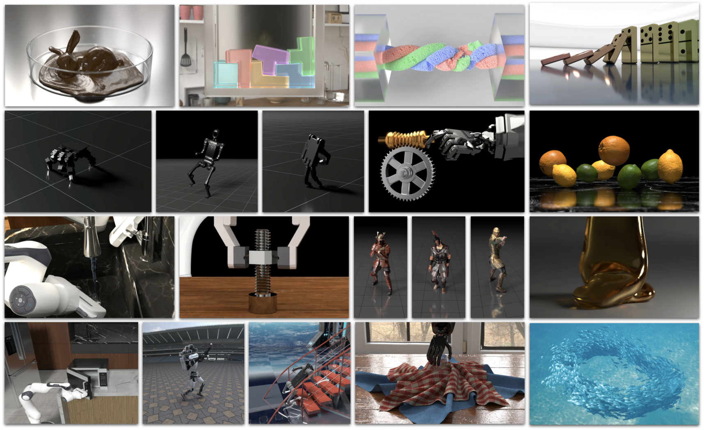

I am currently a Physics Engine Development Engineer at Tesla Optimus🤖 in Palo Alto, CA. I graduated and received my Ph.D. degree from Kahlert School of Computing, the **University of Utah** in 2026. I was co-advised by Professor [<em>Jenny Lin</em>](https://jlin98.github.io/) and Professor [<em>Cem Yuksel</em>](http://www.cemyuksel.com/). Before that, I was advised by Professor [<em>Yin Yang</em>](https://yangzzzy.github.io/).    I grew up in Shanghai, China, and received my Bachelor's Degree in Computer Science from Peking University, China in 2020. Before moving to the U of U and changing my research area to computer graphics in 2022 Fall, I was studying computer networks at Georgia Tech.

### Publications

> 
> 
> **High-Fidelity 4D Cloth Capture Pipeline with a Two-Level Pattern**  
> **Ziheng Liu**, Anka He Chen, Shu Chen, Yin Yang, Cem Yuksel, Jenny Han Lin  
> *ACM Transactions on Graphics (SIGGRAPH), 2026* 
> [🔗 Project Page](https://graphics.cs.utah.edu/research/projects/two-level-cloth-capture-pattern/)  

> 
> 
> **High-performance CPU Cloth Simulation Using Domain-decomposed Projective Dynamics**  
> Zixuan Lu\*, **Ziheng Liu**\* (\*equal contributors), Lei Lan, Huamin Wang, Yuko Ishiwaka, Chenfanfu Jiang, Kui Wu, Yin Yang  
> *ACM Transactions on Graphics (SIGGRAPH), 2025* **Technical Papers Awards: Honorable Mentions**  
> [🔗 Project Page](https://sig25ddmpd.github.io/)  

> 
>
> **Vertex Block Descent**  
> Anka He Chen, **Ziheng Liu**, Yin Yang, Cem Yuksel  
> *ACM Transactions on Graphics (SIGGRAPH), 2024*  
> [🔗 Project Page](https://ankachan.github.io/Projects/VertexBlockDescent/index.html)

> 
>
> **Offset Geometric Contact**  
> Anka He Chen, Jerry Hsu, **Ziheng Liu**, Miles Macklin, Yin Yang, Cem Yuksel  
> *ACM Transactions on Graphics (SIGGRAPH), 2025*  
> [🔗 Project Page](https://graphics.cs.utah.edu/research/projects/ogc/)  

> **RECIPE: Rateless Erasure Codes Induced by Protocol-Based Encoding**  
> Jingfan Meng, **Ziheng Liu**, Yiwei Wang, Jun Xu    
> *2023 IEEE International Symposium on Information Theory (ISIT)*  

> **Space- and Computationally-Efficient Set Reconciliation via Parity Bitmap Sketch (PBS)**  
> Long Gong, **Ziheng Liu**, Liang Liu, Jun Xu, Mitsunori Ogihara, Tong Yang  
> *Proceedings of the VLDB Endowment, Volume 14, Issue 4 (2020)*  

> **Multi-copy cuckoo hashing**  
> Dagang Li, Rong Du, **Ziheng Liu**, Tong Yang, Bin Cui  
> *2019 IEEE 35th International Conference on Data Engineering (ICDE)*  

### Open Source Project
>   
>
> Contributed to Genesis, a physics platform designed for general-purpose Robotics/Embodied AI/Physical AI applications.  
> [🔗 Project Page](https://github.com/Genesis-Embodied-AI/Genesis)  